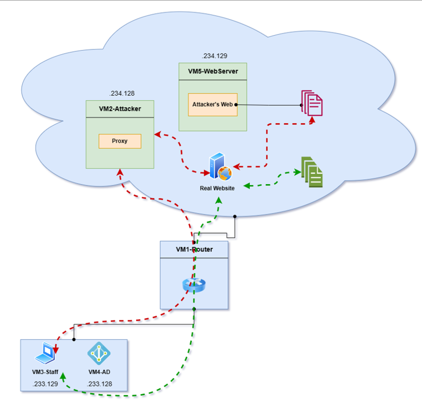

# MITM attacks via the HTTP/HTTPS protocol with mitmproxy

Youtube : https://youtu.be/KgK5l7xoONI

##  Architecture

- Staff: 
    - Join the domain using an account with only Domain User rights.
    - Windows 10 Pro
- Active Directory:
    - Windows Server 2008 R2
    - Using BadBlood and vulnerable-AD to create vulnerable AD
- Proxy:
    - Using mitmproxy
- Webserver Attacker
    - Windows Server 2019

## Traffic Flow 

In the green-line : This is normal traffic when staff access  the internet 

In the red-line : This is the traffic flow that the attacker has redirected to the mitmproxy proxy. Then, Proxy will redirect to malicious resource.

## Attack Scenario 

### Phising

The attacker conducts phishing and sends malware to the staff. Staff downloads and runs this malware on the computer. When executed successfully, the malware modifies the Staff machine's proxy settings to point to the Attacker's proxy, installing the proxy certificate on the Staff machine. As a result, all Staff http/https traffic will be routed through the Attacker proxy.

### Initial Access

The attacker develops a second Malware(.docm) capable of generating reverse shells.
Attacker puts this Malware on Attacker's Website.
Attacker creates an Addons script to:
- Check when Staff downloads any .doc file.
- Replace that doc file with .docm file.

The Attacker receives a Shell on the Staff computer when the Staff opens the docm file.

### Enumerate AD

Perform:
- Domain Computer, Domain User, Group,
- Active Directory information, like Domain Controllers, Password Policy, Sites and Subnets and Trusts.
- Active Directory rights and permissions, like LAPS, DCSync and adding computer to domain
- Enumerates credential exposure issues, like AS-REP Roastable, Kerberoastable

### Attack AD

Kerberoasting : https://attack.mitre.org/techniques/T1558/003/

> If the credential was obtained from a Domain Admin account, it can be used to Persistence, Privilege Escalation, and Lateral Movement.

Golden Ticket: https://attack.mitre.org/techniques/T1558/001/

- DCSync: https://attack.mitre.org/techniques/T1003/006/

> Obtain domain administrator access. Can perform hashdump and pass the hash to any account with access permissions.

## Usage 

-  malware_exec.cpp : First malware to phising
-  addons.py : This is plugin for mitmproxy
